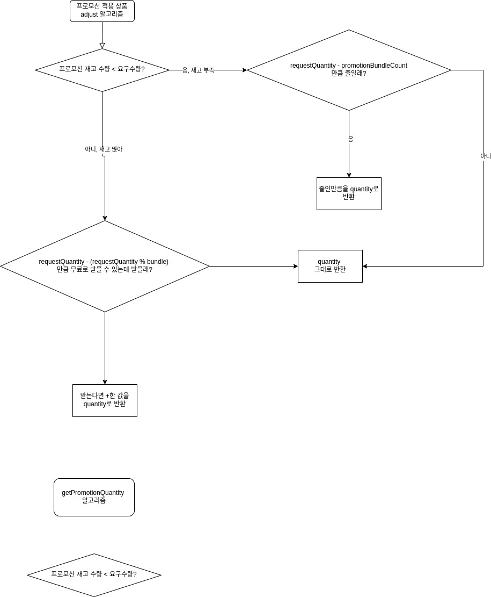

# java-convenience-store-precourse
우아한 테크 코스에서 진행하는 프리코스 4주차 과제입니다.
구매자의 할인 혜택과 재고 상황을 고려하여 최종 결제 금액을 계산하고 안내하는 결제 시스템을 구현해보았습니다.

# 전체 기능 플로우차트

# 프로모션 적용 기능 플로우차트

# 모델 설명
해당 어플리케이션 구현에 사용한 모델은 다음과 같습니다.
- Product: 상품 정보를 관리하는 객체입니다. 
    - products.md 파일에서 읽어온 상품 정보를 저장하는데 사용됩니다. 읽어온 상품들은 ProductTable 객체에서 관리합니다.
    - 거래 정보를 관리하는 객체 Transaction에게 Product를 상속합니다.
- Promotion: 프로모션 정보를 관리하는 객체입니다. promotions.md 파일에서 읽어온 프로모션 정보를 저장합니다. 읽어온 프로모션 정보는 PromotionTable 객체에서 관리합니다.
- PurchaseRequest: 사용자의 구매 요청을 관리하는 객체입니다.
- Transaction: PurchaseRequest에 대응하는 객체입니다. 구매 요청(PurchaseRequest)을 처리(process)해서 반환된 객체입니다. Product를 상속합니다.
- Discount: 할인을 정의하고 할인 정보를 저장하는 객체입니다.
- Receipt: 거래 정보인 Transaction 객체들과 할인 정보인 Discount 객체를 통해 최종 결제를 관리하는 객체입니다.

# 핵심 기능
- [x] products.md, promotion.md에서 재고 정보 읽어 객체로 만들기
    - [x] products.md 파일을 읽기
    - [x] 파일의 데이터를 사용해 품목을 추가
    - [x] promotions.md 파일을 읽기
    - [x] 파일의 데이터를 사용해 프로모션 정보를 추가
- [x] 구매 요청 처리 로직 수행
    - [x] 구매 요청 입력을 객체화
    - [x] 가능한 요청인지 검사
    - [x] 프로모션 여부 검사 후 프로모션 로직을 수행
        - [x] 프로모션 적용 상품인지 검사
        - [x] 프로모션 기간인지 검사
        - [x] 요청한 수량이 프로모션 재고 내에서 처리할 수 있는지 검사
            - 요청한 수량 > 프로모션 재고인 경우, 사용자에게 프로모션이 적용되지 않는 상품이 있음을 알림 + 그 상품들을 결제에서 제외할지 묻기
                - 사용자가 프로모션 비적용 상품을 제외했을 때, 프로모션 적용 상품만 결제 목록에 추가
                - 사용자가 프로모션 비적용 상품을 포함했을 때, 프로모션 적용 상품 + 비적용 상품을 결제 목록에 추가
        - 프로모션 추가 상품을 받을 수 있을 때: 사용자에게 프로모션 상품을 추가할지 묻기
    - [x] 멤버십 할인 로직을 수행
    - [x] 거래 내역을 받아 영수증 만들기
- [x] 재구매 기능

# 입력
- [x] 구매 "[상품-수량]"을 입력
    - [x] 예외적인 상황 처리
        - [x] 잘못 된 형식으로 값을 입력했을 경우
- [x] 의사결정 입력
    - [x] 예외적인 상황 처리
        - [x] "Y" 또는 "N" 이외 다른 값을 입력했을 경우

# 출력
- [x] 재고 정보를 출력
- [x] 영수증 출력
